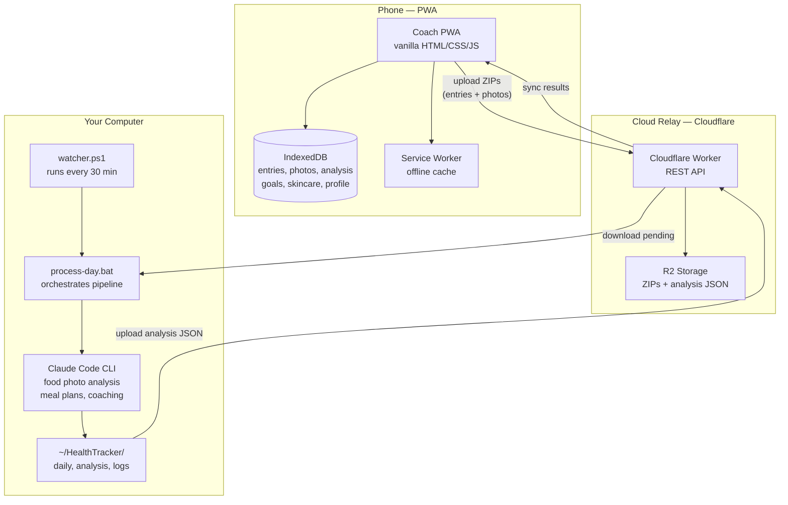
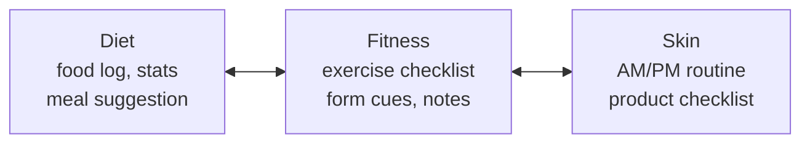

# Coach — AI Health Tracker

A personal health tracking PWA with AI-powered food analysis, workout planning, and daily coaching. Runs entirely on your own devices — no accounts, no cloud subscription, no third-party analytics.

---

## Features

- **Food logging** — log meals by photo or manually; AI estimates calories and macros from photos
- **Calorie & macro tracking** — daily totals, targets, and trend charts
- **Workout logging** — log sets and reps; track against your regimen
- **Meal plans** — AI-generated daily suggestions based on your goals and history
- **Workout recommendations** — personalized based on recent activity and targets
- **Daily scoring** — dual moderate/hardcore scoring so you can see how you track against either plan
- **Water & weight tracking** — quick-log from the home screen
- **Cloud sync** — phone uploads data to a relay; your computer processes and syncs results back
- **Offline-capable** — full PWA, works without a connection

---

## Tech Stack

- **Frontend:** Vanilla HTML/CSS/JS — no framework, no build step
- **Storage:** IndexedDB (on-device)
- **Sync:** Cloudflare Worker + R2 (self-hosted relay)
- **AI processing:** Claude Code CLI (runs on your own computer)
- **Hosting:** GitHub Pages

---

## System Architecture

### Data Flow

1. **Log** — Snap a meal photo or tap to log water/weight/workout on your phone
2. **Upload** — PWA bundles entries + photos into a ZIP, uploads to the relay
3. **Process** — Your computer's watcher downloads the ZIP every 30 min, runs Claude Code to analyze food photos, estimate calories, generate meal plans, and produce coaching feedback
4. **Sync back** — Analysis JSON uploads to the relay, PWA pulls it down and shows inline calories, macro breakdowns, and coach messages

### Today Screen

Three swipeable panels on the Today screen. Each panel has its own content and state, all sharing the same date context and score card.

### Key Design Decisions

| Decision | Rationale |
|----------|-----------|
| No framework | Zero build step, instant deploys, works forever |
| IndexedDB | Structured storage with indexes, no size limits, offline-first |
| Cloudflare Worker relay | Free tier covers personal use, global edge, no server to maintain |
| Claude Code CLI (not API) | Runs on your existing subscription, no API key needed, full tool access |
| Photos analyzed then deleted | Privacy-first: photos never leave your devices permanently |
| Dual scoring (moderate/hardcore) | See progress against both a sustainable plan and a stretch target |

---

## Quick Start

1. **Install the app** — visit the GitHub Pages URL in Safari or Chrome, then Add to Home Screen
2. **Set your goals** — the onboarding wizard walks you through it
3. *(Optional)* **Set up cloud sync + AI processing** for photo analysis and coaching

Full guide: [docs/getting-started.md](docs/getting-started.md)

---

## Self-Hosting

- **Relay (Cloudflare Worker):** [docs/relay-setup.md](docs/relay-setup.md)
- **Processing (Windows / Mac / Linux):** [docs/processing-setup.md](docs/processing-setup.md)

---

## Privacy

- All health data stays on your device and your own infrastructure
- Food photos are analyzed by your own Claude Code subscription — not sent to any third-party service
- The cloud relay (if you deploy it) is your own Cloudflare Worker
- No analytics, no tracking, no accounts

---

## Contributing

See [.claude/skills/contribute/SKILL.md](.claude/skills/contribute/SKILL.md) for development setup and contribution guidelines.

---

## License

MIT
