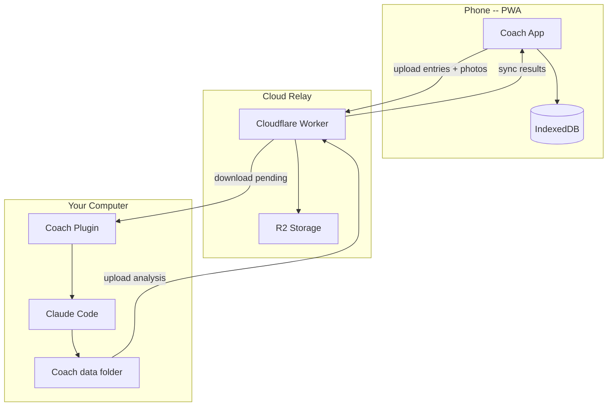

# Coach -- AI Health Tracker

A personal health tracking app with AI-powered food analysis, calorie tracking, workout planning, and daily coaching. Snap food photos from your phone, and Coach analyzes everything -- calories, protein, macros, meal plans, and personalized feedback.

Runs entirely on your own devices. No accounts, no third-party analytics, no API keys.

---

## How It Works

1. **Log from your phone** -- snap meal photos, log workouts, water, weight
2. **Coach processes automatically** -- your computer analyzes photos, estimates calories, generates meal plans
3. **Results sync back** -- analysis, scores, and coaching feedback appear in the app within 30 minutes
4. **Talk to Coach** -- message Coach from the app (async) or start a live session from your terminal

---

## Get Started

### Install Coach

Open a terminal on your computer:

```bash
mkdir coach && cd coach
claude plugin marketplace add nEmily/health-tracker
claude plugin install coach@health-tracker --scope local
claude
```

Coach introduces itself and walks you through everything -- goals, phone setup, and processing.

### Get the App on Your Phone

Visit the [onboarding page](https://nemily.github.io/health-tracker/welcome.html) to scan a QR code or get a direct link. During setup, Coach gives you a 4-digit pairing code to connect your phone.

---

## Features

- **Food photo analysis** -- snap a photo, get calorie and macro estimates
- **Calorie and macro tracking** -- daily totals, targets, and trends
- **Personalized meal plans** -- generated from your goals, preferences, and history
- **Workout tracking** -- log exercises, track against your regimen
- **Daily scoring** -- 0-100 score based on calories, protein, workouts, water, and consistency
- **AI coaching** -- real-time or async, references your actual data (not generic advice)
- **Water and weight tracking** -- quick-log from the home screen
- **Progress insights** -- weekly deficits, streaks, best/worst days, macro splits
- **Cloud sync** -- phone uploads data, your computer processes it, results sync back
- **Offline-capable** -- full PWA, works without a connection
- **Challenge tracking** -- 75 Hard, 30 Hard, custom challenges with shareable progress cards

---

## Tech Stack

| Layer | Tech |
|-------|------|
| Frontend | Vanilla HTML/CSS/JS -- no framework, no build step |
| Storage | IndexedDB (on-device) |
| Sync | Cloudflare Worker + R2 (shared relay) |
| AI processing | Claude Code plugin (runs on your computer) |
| Hosting | GitHub Pages |

---

## Architecture



---

## Privacy

- All health data stays on your devices
- Food photos are analyzed by your own Claude Code subscription
- The cloud relay only passes data between your phone and computer
- No analytics, no tracking, no accounts
- Meal photos are deleted after analysis; body photos stay local

---

## Coach Plugin

Coach is a Claude Code plugin. It activates as your main conversation thread and provides:

- `/coach` -- live 1:1 coaching session
- `/process-day` -- process a day's health data
- `/setup` -- new user onboarding

The plugin includes an auto-generated SDK (`coach-sdk.md`) so Coach understands the data contract, and an app guide (`app-guide.md`) for navigating users through the PWA.

---

## Contributing

See the [contributor guide](.claude/skills/contribute/SKILL.md) for development setup.

---

## License

MIT
